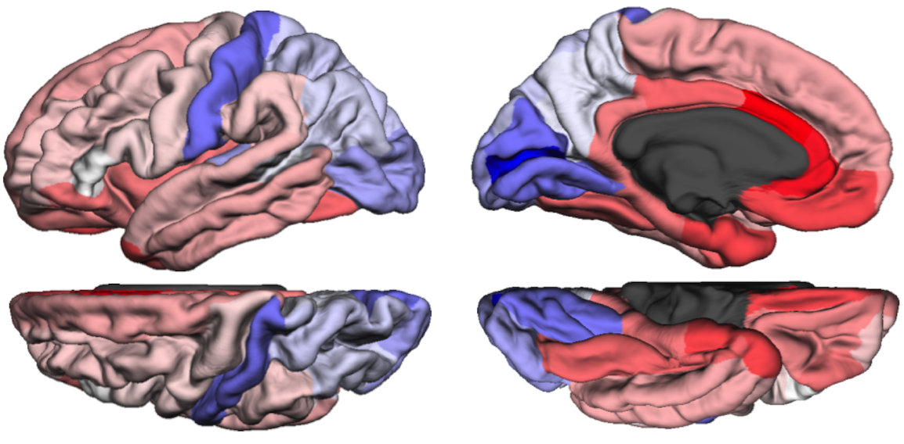

---
output:
  html_document
---

# Computational Neurobiology Laboratory

#### Campbell Family Mental Health Research Institute at [CAMH](http://www.camh.ca/)

We seek to understand diseases of the brain by mining neuroscience resources for deeper insight into brain anatomy, development and illness. Informatics methods are used to exploit the increasing amount of neuroscience data. Specifically, we focus on connectivity, gene expression and epigenetics across the genome and the brain. We employ multifaceted approaches that gain information by using data that crosses scales and species. 

 

Leon French and Tomáš Paus. A FreeSurfer view of the cortical transcriptome generated from the Allen Human Brain Atlas. [Frontiers in Neuroscience, Neurogenomics section](http://journal.frontiersin.org/article/10.3389/fnins.2015.00323/full), August 24, 2015.  