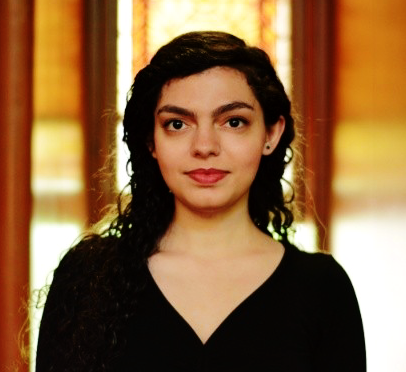
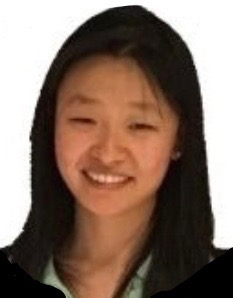
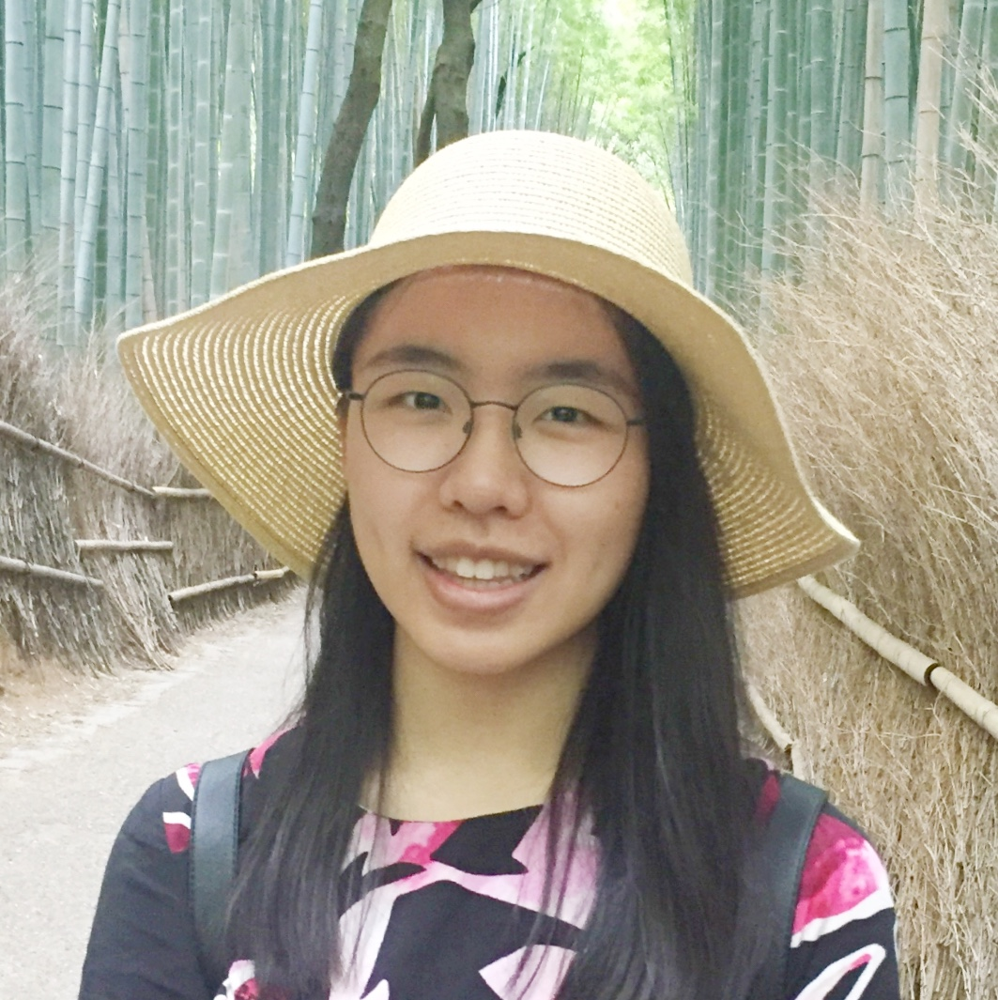

---
output:
  html_document
---
<!---
README:
This is really annoying to edit - the tables are really finicky about spaces - maybe convert to something else - r markdown?
The table widths are relative to the longest column, hence the &nbsp; &nbsp; padding to make sure alignment is right
Also it's best to edit it with a text editor that doesn't wrap lines
-->

#### Leon French, Principal Investigator  
+------------------------------------------------+------------------------------------------------------------------------------------------------------------------------------------+
|                  | | <b>Independent Scientist, Krembil Centre for Neuroinformatics, </b>                                                    |
|                                                | | <b>Campbell Family Mental Health Research Institute at CAMH</b>                                               |
|                                                | | <b>Assistant Professor (status only), Department of Psychiatry, University of Toronto</b>                                            |
|                                                | | <b> Associate Member, Institute of Medical Science, University of Toronto</b>                                            |
|                                                | | Toronto, Ontario, Canada                                                                                                 |
|                                                | |  leon.french@camh.ca                                                                                            |
|                                                | |  [LinkedIn profile](https://ca.linkedin.com/in/leonfrench)                                                                               |
|                                                | |  [Publication list on Google Scholar](https://scholar.google.ca/citations?hl=en&user=zBJxfPEAAAAJ&view_op=list_works&sortby=pubdate)         |
|                                                | |  [ResearchGate profile ](https://www.researchgate.net/profile/Leon_French)                                                         |
+------------------------------------------------+-------------------------------------------------------------------------------------------------------------------------------------+

- - -

#### Derek Howard, Research Analyst

+------------------------------------------------------+--------------------------------------------------------------------------------------------+
|                              | | <b>MSc, University of Toronto</b>                                                        |
|                                                      | | d(dot)howard(at)mail.utoronto.ca                                                        |
|                                                      | |  &nbsp; &nbsp;&nbsp; &nbsp; &nbsp; &nbsp; &nbsp;&nbsp; &nbsp; &nbsp; &nbsp; &nbsp; &nbsp; &nbsp; &nbsp; &nbsp; &nbsp; &nbsp; &nbsp; &nbsp;&nbsp; &nbsp; &nbsp; &nbsp; &nbsp; &nbsp; &nbsp; &nbsp; &nbsp; &nbsp; &nbsp; &nbsp; &nbsp;&nbsp; &nbsp; &nbsp; &nbsp; &nbsp;&nbsp; &nbsp; &nbsp; &nbsp; &nbsp; &nbsp; &nbsp; &nbsp; &nbsp;  |
+------------------------------------------------------+--------------------------------------------------------------------------------------------+

- - -

#### Pegah Abed-Esfahani, Research Analyst  
+------------------------------------------------------+--------------------------------------------------------------------------------------------+
| { width=150px }               | | <b>Research Analyst in Machine Learning</b>                                                        |
|                                                      | | <b>MSc, Computer Science, University of Toronto</b>                                                        |
|                                                      | | pegah.abedesfahani@mail.utoronto.ca                                                                                                |
|                                                      | | [LinkedIn profile](https://www.linkedin.com/in/pegah-abed/)                                                                                                |
|                                                      | |  &nbsp; &nbsp;&nbsp; &nbsp; &nbsp; &nbsp; &nbsp;&nbsp; &nbsp; &nbsp; &nbsp; &nbsp; &nbsp; &nbsp; &nbsp; &nbsp; &nbsp; &nbsp; &nbsp; &nbsp;&nbsp; &nbsp; &nbsp; &nbsp; &nbsp; &nbsp; &nbsp; &nbsp; &nbsp; &nbsp; &nbsp; &nbsp; &nbsp;&nbsp; &nbsp; &nbsp; &nbsp; &nbsp;&nbsp; &nbsp; &nbsp; &nbsp; &nbsp; &nbsp; &nbsp; &nbsp; &nbsp;  |
+------------------------------------------------------+--------------------------------------------------------------------------------------------+

- - -

#### Wennie Wu, Master's Student (co-supervised by Dr. Etienne Sibille)
+------------------------------------------------------+--------------------------------------------------------------------------------------------+
| { width=150px }              | | <b>Master's Student</b>                                                        |
|                                                      | | <b>BSc, Biomedical Computing, Queen's University</b>                                                        |
|                                                      | | wennie.wu@mail.utoronto.ca                                                                                                |
|                                                      | | [LinkedIn profile](https://www.linkedin.com/in/wennie-wu-047755142/)                                                                                                |
|                                                      | |  &nbsp; &nbsp;&nbsp; &nbsp; &nbsp; &nbsp; &nbsp;&nbsp; &nbsp; &nbsp; &nbsp; &nbsp; &nbsp; &nbsp; &nbsp; &nbsp; &nbsp; &nbsp; &nbsp; &nbsp;&nbsp; &nbsp; &nbsp; &nbsp; &nbsp; &nbsp; &nbsp; &nbsp; &nbsp; &nbsp; &nbsp; &nbsp; &nbsp;&nbsp; &nbsp; &nbsp; &nbsp; &nbsp;&nbsp; &nbsp; &nbsp; &nbsp; &nbsp; &nbsp; &nbsp; &nbsp; &nbsp;  |
+------------------------------------------------------+--------------------------------------------------------------------------------------------+

- - -

#### Minh An Ho, Undergraduate Project Student

+------------------------------------------------------+--------------------------------------------------------------------------------------------+
|   { width=150px }            | | <b>BCB and Statistics program, University of Toronto</b>                                                        |
|                                                      | | minhan.ho@mail.utoronto.ca                                                        |
|                                                      | |  &nbsp; &nbsp;&nbsp; &nbsp; &nbsp; &nbsp; &nbsp;&nbsp; &nbsp; &nbsp; &nbsp; &nbsp; &nbsp; &nbsp; &nbsp; &nbsp; &nbsp; &nbsp; &nbsp; &nbsp;&nbsp; &nbsp; &nbsp; &nbsp; &nbsp; &nbsp; &nbsp; &nbsp; &nbsp; &nbsp; &nbsp; &nbsp; &nbsp;&nbsp; &nbsp; &nbsp; &nbsp; &nbsp;&nbsp; &nbsp; &nbsp; &nbsp; &nbsp; &nbsp; &nbsp; &nbsp; &nbsp;  |
+------------------------------------------------------+--------------------------------------------------------------------------------------------+

- - -

#### Xindi Zhang, Undergraduate Project Student
+------------------------------------------------------+--------------------------------------------------------------------------------------------+
| { width=150px }               | | <b>BCB and Biology, University of Toronto</b>                                                        |
|                                                      | | Xindi.Zhang@mail.utoronto.ca                                                        |
|                                                      | |  &nbsp; &nbsp;&nbsp; &nbsp; &nbsp; &nbsp; &nbsp;&nbsp; &nbsp; &nbsp; &nbsp; &nbsp; &nbsp; &nbsp; &nbsp; &nbsp; &nbsp; &nbsp; &nbsp; &nbsp;&nbsp; &nbsp; &nbsp; &nbsp; &nbsp; &nbsp; &nbsp; &nbsp; &nbsp; &nbsp; &nbsp; &nbsp; &nbsp;&nbsp; &nbsp; &nbsp; &nbsp; &nbsp;&nbsp; &nbsp; &nbsp; &nbsp; &nbsp; &nbsp; &nbsp; &nbsp; &nbsp;  |
+------------------------------------------------------+--------------------------------------------------------------------------------------------+

- - -

### Previous members

- - -
#### Jenny Yin, Undergraduate Summer Student
+------------------------------------------------------+--------------------------------------------------------------------------------------------+
| { width=150px }               | | <b>BCB and Computer Science, University of Toronto</b>                                                        |
|                                                      | | jenny.yin@mail.utoronto.ca                                                        |
|                                                      | |  &nbsp; &nbsp;&nbsp; &nbsp; &nbsp; &nbsp; &nbsp;&nbsp; &nbsp; &nbsp; &nbsp; &nbsp; &nbsp; &nbsp; &nbsp; &nbsp; &nbsp; &nbsp; &nbsp; &nbsp;&nbsp; &nbsp; &nbsp; &nbsp; &nbsp; &nbsp; &nbsp; &nbsp; &nbsp; &nbsp; &nbsp; &nbsp; &nbsp;&nbsp; &nbsp; &nbsp; &nbsp; &nbsp;&nbsp; &nbsp; &nbsp; &nbsp; &nbsp; &nbsp; &nbsp; &nbsp; &nbsp;  |
+------------------------------------------------------+--------------------------------------------------------------------------------------------+

- - -

#### Linwen Huang, Undergraduate Project Student
+------------------------------------------------------+--------------------------------------------------------------------------------------------+
| { width=150px }              | | <b>LMP and Computer Science, University of Toronto</b>                                                        |
|                                                      | | linwenh.huang@mail.utoronto.ca                                                      |
|                                                      | |  &nbsp; &nbsp;&nbsp; &nbsp; &nbsp; &nbsp; &nbsp;&nbsp; &nbsp; &nbsp; &nbsp; &nbsp; &nbsp; &nbsp; &nbsp; &nbsp; &nbsp; &nbsp; &nbsp; &nbsp;&nbsp; &nbsp; &nbsp; &nbsp; &nbsp; &nbsp; &nbsp; &nbsp; &nbsp; &nbsp; &nbsp; &nbsp; &nbsp;&nbsp; &nbsp; &nbsp; &nbsp; &nbsp;&nbsp; &nbsp; &nbsp; &nbsp; &nbsp; &nbsp; &nbsp; &nbsp; &nbsp;  |
+------------------------------------------------------+--------------------------------------------------------------------------------------------+

- - -

#### Joelle Jee, Undergraduate Project Student
+------------------------------------------------------+--------------------------------------------------------------------------------------------+
| { width=150px }              | | <b>BCB, University of Toronto</b>                                                        |
|                                                      | | joelle.jee@mail.utoronto.ca                                                      |
|                                                      | |  &nbsp; &nbsp;&nbsp; &nbsp; &nbsp; &nbsp; &nbsp;&nbsp; &nbsp; &nbsp; &nbsp; &nbsp; &nbsp; &nbsp; &nbsp; &nbsp; &nbsp; &nbsp; &nbsp; &nbsp;&nbsp; &nbsp; &nbsp; &nbsp; &nbsp; &nbsp; &nbsp; &nbsp; &nbsp; &nbsp; &nbsp; &nbsp; &nbsp;&nbsp; &nbsp; &nbsp; &nbsp; &nbsp;&nbsp; &nbsp; &nbsp; &nbsp; &nbsp; &nbsp; &nbsp; &nbsp; &nbsp;  |
+------------------------------------------------------+--------------------------------------------------------------------------------------------+

- - -

#### Justin Lee, Undergraduate Project Student

+------------------------------------------------------+--------------------------------------------------------------------------------------------+
|   { width=150px }            | | <b>BCB and Statistics program, University of Toronto</b>                                                        |
|                                                      | | chunhin.lee@mail.utoronto.ca                                                        |
|                                                      | |  &nbsp; &nbsp;&nbsp; &nbsp; &nbsp; &nbsp; &nbsp;&nbsp; &nbsp; &nbsp; &nbsp; &nbsp; &nbsp; &nbsp; &nbsp; &nbsp; &nbsp; &nbsp; &nbsp; &nbsp;&nbsp; &nbsp; &nbsp; &nbsp; &nbsp; &nbsp; &nbsp; &nbsp; &nbsp; &nbsp; &nbsp; &nbsp; &nbsp;&nbsp; &nbsp; &nbsp; &nbsp; &nbsp;&nbsp; &nbsp; &nbsp; &nbsp; &nbsp; &nbsp; &nbsp; &nbsp; &nbsp;  |
+------------------------------------------------------+--------------------------------------------------------------------------------------------+

- - -

#### Alana Man, Undergraduate Project Student

+------------------------------------------------------+--------------------------------------------------------------------------------------------+
| { width=150px }               | | <b>BCB and Computer Science, University of Toronto</b>                                                        |
|                                                      | | alana.man@mail.utoronto.ca                                                        |
|                                                      | |  &nbsp; &nbsp;&nbsp; &nbsp; &nbsp; &nbsp; &nbsp;&nbsp; &nbsp; &nbsp; &nbsp; &nbsp; &nbsp; &nbsp; &nbsp; &nbsp; &nbsp; &nbsp; &nbsp; &nbsp;&nbsp; &nbsp; &nbsp; &nbsp; &nbsp; &nbsp; &nbsp; &nbsp; &nbsp; &nbsp; &nbsp; &nbsp; &nbsp;&nbsp; &nbsp; &nbsp; &nbsp; &nbsp;&nbsp; &nbsp; &nbsp; &nbsp; &nbsp; &nbsp; &nbsp; &nbsp; &nbsp;  |
+------------------------------------------------------+--------------------------------------------------------------------------------------------+

- - -

#### Jacob Ritchie, Undergraduate Researcher

+------------------------------------------------------+--------------------------------------------------------------------------------------------+
|             | | <b>Engineering Science, University of Toronto</b>                                        |
|                                                      | | jacob.ritchie@mail.utoronto.ca                                                          |
|                                                      | |  &nbsp; &nbsp;&nbsp; &nbsp; &nbsp; &nbsp; &nbsp;&nbsp; &nbsp; &nbsp; &nbsp; &nbsp; &nbsp; &nbsp; &nbsp; &nbsp; &nbsp; &nbsp; &nbsp; &nbsp;&nbsp; &nbsp; &nbsp; &nbsp; &nbsp; &nbsp; &nbsp; &nbsp; &nbsp; &nbsp; &nbsp; &nbsp; &nbsp;&nbsp; &nbsp; &nbsp; &nbsp; &nbsp;&nbsp; &nbsp; &nbsp; &nbsp; &nbsp; &nbsp; &nbsp; &nbsp; &nbsp;  |
+------------------------------------------------------+--------------------------------------------------------------------------------------------+
                                                
- - -
                                                                   
More to come (please see [positions](./positions.html))

[Instructions to add yourself](https://github.com/computationalneurobiology/ComputationalNeurobiology.github.io/tree/master)